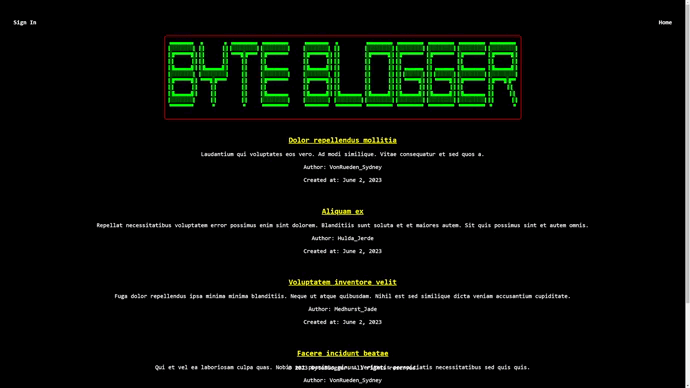

<h1 align="center">CMS-Style Blog Site</h1>

  

  CMS-Style Blog Site is a web application that allows users to create, read, update, and delete blog posts, as well as leave comments on the posts. It provides a user-friendly interface for managing blog content.

## Table of Contents

- [Description](#description)
- [Features](#features)
- [Packages Used](#packages-used)
- [Installation](#installation)
- [Usage](#usage)
- [Live deployment using Render](#live-deployment-using-render)
- [Contributing](#contributing)
- [License](#license)
- [Contact](#contact)

## Description

CMS-Style Blog Site is a full-stack web application built with HTML, CSS, JavaScript, and [insert any additional technologies/frameworks used]. It follows the Model-View-Controller (MVC) architectural pattern and utilizes a CMS (Content Management System) approach for managing blog posts and user authentication.

The application provides a homepage that displays existing blog posts (if any) and offers navigation links for easy access to the homepage, user dashboard, and login/logout functionality. Users can sign up with a unique username and password, and once logged in, they have the ability to create, update, and delete their own blog posts. Users can also view individual blog posts, leave comments, and see comments from other users.

## Features

User Authentication:

- Signup:
  - Collect user details (username, email, password) on the signup page.
  - Implement password complexity requirements, such as having at least one uppercase letter and special character, using regex validation.
    - Show an alert message to the user if the password does not meet the complexity requirements.
  - Hash the user's password using bcrypt before storing it in the database.
    - Bcrypt is a popular hashing algorithm that adds a layer of security by encrypting the passwords.

- Signin:
  - Validate the user's credentials (username/email and password) entered on the signin page.
  - Retrieve the hashed password from the database for the corresponding user.
  - Use bcrypt to compare the provided password with the stored hashed password.
    - If the passwords match, allow the user to proceed to the dashboard.
    - If the passwords don't match, show an error message indicating incorrect credentials.

- Logout:
  - Provide a logout button or link in the user dashboard to allow users to sign out of their accounts.
  - When the user clicks on the logout button, invalidate the session or token associated with their login, ensuring they can no longer access protected routes until they sign in again.

- Existing Account Check:
  - Before allowing a new user to sign up, check if the provided username or email already exists in the database.
    - Show an alert message to the user if the username or email is already taken.
    - Ensure the check is case-insensitive to prevent duplicates.

Other Features:

- Homepage displaying existing blog posts
- User dashboard to manage blog posts
- Create, update, and delete blog posts
- View individual blog posts with comments
- Leave comments on blog posts
- User-friendly interface

## Packages Used

The CMS-Style Blog Site project utilises the following packages:

<ul>
  <li><a href="https://www.npmjs.com/package/bcrypt">bcrypt</a> (version 5.1.0 or later)</li>
  <li><a href="https://www.npmjs.com/package/casual">casual</a> (version 1.6.2 or later)</li>
  <li><a href="https://www.npmjs.com/package/connect-session-sequelize">connect-session-sequelize</a> (version 7.1.7 or later)</li>
  <li><a href="https://www.npmjs.com/package/dotenv">dotenv</a> (version 16.0.3 or later)</li>
  <li><a href="https://www.npmjs.com/package/express">express</a> (version 4.18.2 or later)</li>
  <li><a href="https://www.npmjs.com/package/express-handlebars">express-handlebars</a> (version 5.3.5 or later)</li>
  <li><a href="https://www.npmjs.com/package/express-session">express-session</a> (version 1.17.3 or later)</li>
  <li><a href="https://www.npmjs.com/package/mysql2">mysql2</a> (version 3.3.3 or later)</li>
  <li><a href="https://www.npmjs.com/package/sequelize">sequelize</a> (version 6.31.1 or later)</li>
</ul>

## Installation

To run the CMS-Style Blog Site locally, follow these steps:

1. Clone the repository: `git clone https://github.com/L10N37/ByteBlogger.git`
2. Navigate to the project directory: `cd ByteBlogger`
3. Install the dependencies: `npm install`
4. Set up the database: You need to fill out the `.env` file with your MySQL credentials. There is an example `.env` file as reference. After that, you are able to run the following commands:
   - Create the database: `npm run createdb`
   - Create the tables: `npm run createtables`
   - Seed the database with fake data (optional): `npm run seed`
5. Start the application: `npm start`

## Usage

- Open your web browser and navigate to the application's URL, by default it will be `http://localhost:3000/home`
- You will be directed to the homepage where you can browse existing blog posts.
- Click on the navigation links to access different pages, such as the dashboard, login, or sign-up pages.
- Sign up for an account or log in if you already have one.
- Once logged in, you can create new blog posts, view, update, or delete existing posts.
- Click on individual blog posts to view their details, leave comments, or see existing comments.
- Enjoy managing your blog content and interacting with other users!

## Live deployment using Render

To deploy a MySQL database to Render using Clever Cloud, the following steps were taken:

-The local database folder, located at C:\ProgramData\MySQL\MySQL Server 8.0, was compressed into a ZIP file. This folder contains the necessary database files and configurations.

-The compressed database folder was then imported directly into the MySQL service provided by Clever Cloud. This step allowed for the seamless transfer of the database without the need to manually recreate tables or use the graphical online interface.

-The next step involved copying the environment variables from the Clever Cloud service to Render's environment variables section. These environment variables contain important configuration details such as host, port, username, password, and database name. There are multiple approaches you can use. I used a secret credentials file formatted like the '.env' file for local use. The credential names just had to be changed to suit the application.

-By configuring the environment variables in Render, the application was able to successfully connect to the MySQL database hosted on Clever Cloud.

This approach streamlined the deployment process by avoiding the manual creation of tables and allowed for the efficient transfer of the database from the local environment to the cloud-based infrastructure.

## Live Application

[**Visit the Live Application**](https://byteblogger.onrender.com/home)

## Contributing

Contributions are welcome! If you would like to contribute to the CMS-Style Blog Site, please follow these steps:

1. Fork the project repository.
2. Create your own branch: `git checkout -b feature/your-feature`
3. Commit your changes: `git commit -m 'Add some feature'`
4. Push to the branch: `git push origin feature/your-feature`
5. Open a pull request.

## License

This project is licensed under the [MIT LICENSE](LICENSE) - see the `LICENSE` file for details.

## Contact

For any inquiries or questions, please contact:

  - Email: vajskids@gmail.com
  - GitHub: [L10N37](https://github.com/L10N37)
